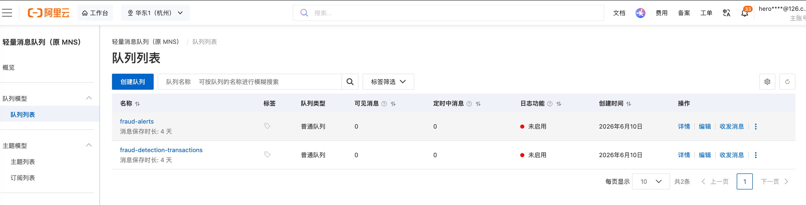
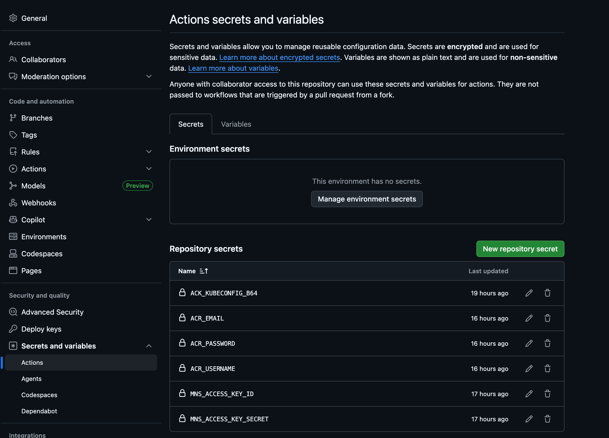
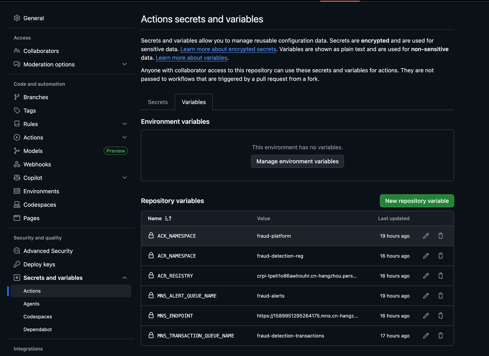

# Installation Guide

This document explains how to deploy the fraud detection platform in two ways:

1. GitHub fork + GitHub Actions workflow
2. Direct Kubernetes deployment with the `k8s/` manifests

The platform contains three applications:

- `transaction-api`: receives transaction data by HTTP and TCP and publishes to Alibaba Cloud MNS
- `fraud-processor`: consumes transaction messages, evaluates fraud rules, and publishes alerts
- `alert-handler`: consumes alert messages and routes them to logging, email placeholder logic, and Telegram placeholder logic

## Architecture Prerequisites

You should already have these services prepared before deployment:

- Alibaba Cloud ACK: the Kubernetes cluster that runs the applications
- Alibaba Cloud MNS / SMQ: queues used by the platform
- Alibaba Cloud ACR: the container registry that stores the three images
- Prometheus or ACK Managed Prometheus: optional but recommended for scraping `/actuator/prometheus`

The expected MNS resources are:

- transaction queue: `fraud-detection-transactions`
- alert queue: `fraud-alerts`
  

The Kubernetes namespace used by the manifests is:

- `fraud-platform`

---

## 1. Deploy via GitHub Fork and Workflow

### 1.1 Prerequisites

Before using the GitHub workflow, make sure you have:

- an ACK cluster that you can access with `kubectl`
- an Alibaba Cloud MNS endpoint, access key ID, and access key secret
- an Alibaba Cloud ACR namespace and image push credentials
- a GitHub account
- permission to create GitHub repository variables and secrets

### 1.2 What the Workflow Does

The repository contains a GitHub Actions workflow at:

- [`.github/workflows/ci-cd.yml`](/Users/vincent/git-workspace/test-app/.github/workflows/ci-cd.yml)

It does three jobs:

1. runs Maven verify and generates test coverage
2. builds and pushes the three Docker images to Alibaba Cloud ACR
3. deploys the updated manifests and images to the ACK cluster

Any push to either branch below triggers build and deployment:

- `main`
- `master`

Pull requests trigger build and test, but not ACK deployment.

### 1.3 Fork the Repository

1. Open the repository on GitHub.
2. Click `Fork`.
3. Create the fork under your own GitHub account or organization.
4. Clone your fork locally if you want to make changes:

```bash
git clone <your-fork-url>
cd test-app
```

### 1.4 Configure GitHub Variables and Secrets

Open your fork in GitHub and go to:

- `Settings`
- `Secrets and variables`
- `Actions`

Use these screenshots as reference:




#### GitHub Variables

Create these repository variables:

| Key | Purpose | Example |
| --- | --- | --- |
| `ACR_REGISTRY` | Alibaba Cloud ACR registry hostname | `crpi-tpeh1o86awlrouhr.cn-hangzhou.personal.cr.aliyuncs.com` |
| `ACR_NAMESPACE` | ACR namespace / repository group | `fraud-detection-reg` |
| `MNS_ENDPOINT` | Alibaba Cloud MNS endpoint used by all three services | `https://1589951295264175.mns.cn-hangzhou.aliyuncs.com` |
| `MNS_TRANSACTION_QUEUE_NAME` | transaction queue name | `fraud-detection-transactions` |
| `MNS_ALERT_QUEUE_NAME` | alert queue name | `fraud-alerts` |

#### GitHub Secrets

Create these repository secrets:

| Key | Purpose |
| --- | --- |
| `ACR_USERNAME` | Alibaba Cloud ACR username used by Docker login |
| `ACR_PASSWORD` | Alibaba Cloud ACR password or access token |
| `ACR_EMAIL` | email field used when creating the image pull secret in Kubernetes |
| `ACK_KUBECONFIG_B64` | base64-encoded kubeconfig for the target ACK cluster |
| `MNS_ACCESS_KEY_ID` | Alibaba Cloud MNS access key ID |
| `MNS_ACCESS_KEY_SECRET` | Alibaba Cloud MNS access key secret |

### 1.5 How to Get `ACK_KUBECONFIG_B64`

1. Export a working kubeconfig for the target ACK cluster.
2. Base64-encode it:

```bash
base64 < ~/.kube/config
```

On macOS, if you want a single-line value:

```bash
base64 -i ~/.kube/config | tr -d '\n'
```

3. Copy the output into the GitHub secret `ACK_KUBECONFIG_B64`.

Use the kubeconfig that works for your target cluster. If you have both temporary and normal kubeconfig options, prefer the normal one unless you explicitly want a short-lived credential.

### 1.6 Trigger the Deployment

After the variables and secrets are configured:

1. push a commit to `main` or `master`
2. GitHub Actions will:
   - run tests and coverage
   - build jars
   - build Docker images
   - push images to ACR
   - apply the Kubernetes manifests
   - update the deployment images in ACK

Example:

```bash
git add .
git commit -m "Update deployment"
git push origin master
```

### 1.7 What Gets Applied to ACK

The workflow applies:

- `k8s/namespace.yaml`
- `k8s/transaction-api-configmap.yaml`
- `k8s/fraud-processor-configmap.yaml`
- `k8s/alert-handler-configmap.yaml`
- `k8s/transaction-api-deployment.yaml`
- `k8s/transaction-api-service.yaml`
- `k8s/transaction-api-hpa.yaml`
- `k8s/fraud-processor-deployment.yaml`
- `k8s/fraud-processor-hpa.yaml`
- `k8s/alert-handler-deployment.yaml`
- `k8s/alert-handler-hpa.yaml`

It also creates or updates:

- Docker image pull secret: `acr-credentials`
- MNS secret: `mns-credentials`
- shared config map: `fraud-platform-shared-config`

### 1.8 Verify the Deployment

```bash
kubectl -n fraud-platform get pods
kubectl -n fraud-platform get svc
kubectl -n fraud-platform rollout status deployment/transaction-api --timeout=5m
kubectl -n fraud-platform rollout status deployment/fraud-processor --timeout=5m
kubectl -n fraud-platform rollout status deployment/alert-handler --timeout=5m
```

To inspect metrics:

```bash
kubectl -n fraud-platform port-forward deploy/fraud-processor 8080:8080
curl http://127.0.0.1:8080/actuator/prometheus | grep fraud_
```

---

## 2. Deploy via Direct Kubernetes Scripts

### 2.1 Prerequisites

Before deploying directly with `kubectl`, make sure you have:

- a working Kubernetes cluster, preferably ACK
- `kubectl` configured against that cluster
- Alibaba Cloud MNS queues and credentials
- a container registry containing the 3 application images
- Prometheus or ACK Managed Prometheus if you want centralized scraping of `/actuator/prometheus`

### 2.2 Container Images

If you want to use the public Alibaba Cloud personal registry images directly, use these image names:

- `crpi-tpeh1o86awlrouhr.cn-hangzhou.personal.cr.aliyuncs.com/fraud-detection-reg/transaction-api:latest`
- `crpi-tpeh1o86awlrouhr.cn-hangzhou.personal.cr.aliyuncs.com/fraud-detection-reg/fraud-processor:latest`
- `crpi-tpeh1o86awlrouhr.cn-hangzhou.personal.cr.aliyuncs.com/fraud-detection-reg/alert-handler:latest`

If you prefer to push images yourself, build and push your own equivalents and update the deployment manifests or run `kubectl set image` after apply.

### 2.3 Create Namespace

```bash
kubectl apply -f k8s/namespace.yaml
```

### 2.4 Create MNS Secret

```bash
kubectl -n fraud-platform create secret generic mns-credentials \
  --from-literal=MNS_ACCESS_KEY_ID='<your-access-key-id>' \
  --from-literal=MNS_ACCESS_KEY_SECRET='<your-access-key-secret>'
```

### 2.5 Create Shared Config

If you want to manage the shared config manually:

```bash
kubectl -n fraud-platform create configmap fraud-platform-shared-config \
  --from-literal=MNS_ENDPOINT='https://<your-account-id>.mns.cn-hangzhou.aliyuncs.com' \
  --from-literal=MNS_TRANSACTION_QUEUE_NAME='fraud-detection-transactions' \
  --from-literal=MNS_ALERT_QUEUE_NAME='fraud-alerts' \
  --from-literal=LOGGING_JSON_ENABLED='true'
```

If you prefer the checked-in manifest, update it first and then apply it:

- [`k8s/shared-configmap.yaml`](/Users/vincent/git-workspace/test-app/k8s/shared-configmap.yaml)

### 2.6 Apply ConfigMaps

```bash
kubectl apply -f k8s/transaction-api-configmap.yaml
kubectl apply -f k8s/fraud-processor-configmap.yaml
kubectl apply -f k8s/alert-handler-configmap.yaml
```

### 2.7 Apply Deployments and Service

```bash
kubectl apply -f k8s/transaction-api-deployment.yaml
kubectl apply -f k8s/transaction-api-service.yaml
kubectl apply -f k8s/transaction-api-hpa.yaml

kubectl apply -f k8s/fraud-processor-deployment.yaml
kubectl apply -f k8s/fraud-processor-hpa.yaml

kubectl apply -f k8s/alert-handler-deployment.yaml
kubectl apply -f k8s/alert-handler-hpa.yaml
```

### 2.8 Override the Image Names

If the checked-in manifests still point to placeholder or older registry values, set the images explicitly after deployment:

```bash
kubectl -n fraud-platform set image deployment/transaction-api \
  transaction-api=crpi-tpeh1o86awlrouhr.cn-hangzhou.personal.cr.aliyuncs.com/fraud-detection-reg/transaction-api:latest

kubectl -n fraud-platform set image deployment/fraud-processor \
  fraud-processor=crpi-tpeh1o86awlrouhr.cn-hangzhou.personal.cr.aliyuncs.com/fraud-detection-reg/fraud-processor:latest

kubectl -n fraud-platform set image deployment/alert-handler \
  alert-handler=crpi-tpeh1o86awlrouhr.cn-hangzhou.personal.cr.aliyuncs.com/fraud-detection-reg/alert-handler:latest
```

### 2.9 Verify the Rollout

```bash
kubectl -n fraud-platform get pods
kubectl -n fraud-platform get svc
kubectl -n fraud-platform rollout status deployment/transaction-api --timeout=5m
kubectl -n fraud-platform rollout status deployment/fraud-processor --timeout=5m
kubectl -n fraud-platform rollout status deployment/alert-handler --timeout=5m
```

### 2.10 Test the Public Endpoint

If the `transaction-api` service is exposed by `LoadBalancer`, get its public IP:

```bash
kubectl -n fraud-platform get svc transaction-api
```

Then test it:

```bash
BASE_URL=http://<external-ip>/ ./scripts/send-transactions.sh testtransactions.csv
```

### 2.11 View the Metrics

Each service exposes Prometheus metrics at:

- `http://<host>:8080/actuator/prometheus`

Examples:

```bash
kubectl -n fraud-platform port-forward deploy/transaction-api 8081:8080
curl http://127.0.0.1:8081/actuator/prometheus | grep fraud_

kubectl -n fraud-platform port-forward deploy/fraud-processor 8082:8080
curl http://127.0.0.1:8082/actuator/prometheus | grep fraud_

kubectl -n fraud-platform port-forward deploy/alert-handler 8083:8080
curl http://127.0.0.1:8083/actuator/prometheus | grep fraud_
```

Expected custom metrics:

- `fraud_ingress_transactions_total`
- `fraud_data_points_processed_total`
- `fraud_alerts_handled_total`

### 2.12 Recommended Prometheus Queries

Per node:

```promql
sum by (node) (fraud_ingress_transactions_total)
sum by (node) (fraud_data_points_processed_total)
sum by (node) (fraud_alerts_handled_total)
```

Rate by node:

```promql
sum by (node) (rate(fraud_ingress_transactions_total[5m]))
sum by (node) (rate(fraud_data_points_processed_total[5m]))
sum by (node) (rate(fraud_alerts_handled_total[5m]))
```

---

## Notes

- The GitHub workflow deploys on pushes to `main` and `master`.
- The direct Kubernetes method gives you more manual control, but you must manage secrets, config maps, and image names yourself.
- If ACK cannot pull images, verify the registry credentials and `imagePullSecrets`.
- If the pods start but do not process messages, verify:
  - `MNS_ENDPOINT`
  - queue names
  - MNS access key credentials
- If metrics do not show up in Prometheus, verify:
  - `/actuator/prometheus` is reachable
  - pod annotations are present
  - `NODE_NAME` exists in pod env
  - Prometheus is configured to scrape the namespace
