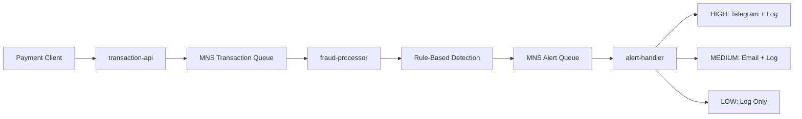

# Fraud Platform on Alibaba Cloud SMQ

This repository is split into three independently scalable Spring Boot applications plus one shared module:

- `transaction-api`: receives transactions over HTTP and publishes them to an Alibaba Cloud MNS transaction queue
- `fraud-processor`: consumes transaction messages, applies fraud rules, and publishes alert events to a separate Alibaba Cloud MNS alert queue
- `alert-handler`: consumes alert events and routes them by severity using preconfigured actions
- `shared`: common DTOs used by all applications

## Architecture



## Why this scales horizontally

- `transaction-api` is stateless and can run behind a Kubernetes `Service` with multiple replicas.
- `fraud-processor` uses competing consumers on the transaction queue, so more replicas increase processing throughput safely.
- `alert-handler` uses competing consumers on the alert queue, so alert delivery can scale independently of detection.
- Separate queues decouple ingestion, detection, and notification workloads.

## Module layout

```text
shared/
transaction-api/
fraud-processor/
alert-handler/
k8s/
```

## Build

Build everything:

```bash
mvn -DskipTests package
```

Build a single service:

```bash
mvn -pl transaction-api -am -DskipTests package
mvn -pl fraud-processor -am -DskipTests package
mvn -pl alert-handler -am -DskipTests package
```

The `package` phase builds the jar on the host first, then builds each Docker image from the module Dockerfile. To skip Docker image creation:

```bash
mvn -Ddocker.skip=true verify
```

## Local run

```bash
mvn -pl transaction-api spring-boot:run
mvn -pl fraud-processor spring-boot:run
mvn -pl alert-handler spring-boot:run
```

## Shared configuration

All services share the same MNS endpoint and credentials. Two queues are used:

```bash
export MNS_ENDPOINT=http://<account-id>.mns.<region>.aliyuncs.com/
export MNS_TRANSACTION_QUEUE_NAME=fraud-transactions
export MNS_ALERT_QUEUE_NAME=fraud-alerts
export MNS_ACCESS_KEY_ID=<your-access-key-id>
export MNS_ACCESS_KEY_SECRET=<your-access-key-secret>
```

Shared Kubernetes values are now created by the GitHub Actions deploy job from GitHub Variables.

## Application behavior

### `transaction-api`

Publishes a transaction event with `POST /api/v1/transactions`.

Example:

```bash
curl -X POST http://localhost:8080/api/v1/transactions \
  -H "Content-Type: application/json" \
  -d '{
    "accountId": "acct-blacklist-001",
    "merchantId": "merchant-123",
    "deviceId": "device-007",
    "ipAddress": "192.168.1.25",
    "currency": "USD",
    "amount": 250.00
  }'
```

### `fraud-processor`

Consumes transaction events and evaluates rule-based fraud checks.

```bash
export CONSUMER_POLLER_CONCURRENCY=2
export CONSUMER_BATCH_SIZE=8
export CONSUMER_WAIT_SECONDS=15
export FRAUD_AMOUNT_THRESHOLD=10000
```

If a transaction is suspicious, `fraud-processor` publishes an `AlertEvent` to the alert queue instead of sending notifications directly.

Current severity behavior:

- `HIGH`: multiple fraud reasons, suspicious account, or amount threshold breach
- `MEDIUM`: suspicious merchant-only alerts
- `LOW`: any future generic anomaly reason not matched by the higher rules

### `alert-handler`

Consumes alert events from the alert queue and applies routing rules based on severity.

Default actions in [alert-handler application.yml](/Users/vincent/git-workspace/test-app/alert-handler/src/main/resources/application.yml):

- `HIGH`: `TELEGRAM`, `LOG`
- `MEDIUM`: `EMAIL`, `LOG`
- `LOW`: `LOG`

The Telegram and email sender implementations are placeholders for later integration and currently log intent only.

## Docker images

Default image names:

- `fraud/transaction-api:0.0.1-SNAPSHOT`
- `fraud/fraud-processor:0.0.1-SNAPSHOT`
- `fraud/alert-handler:0.0.1-SNAPSHOT`

Override the image prefix if needed:

```bash
mvn -pl alert-handler -am -DskipTests -Ddocker.image.prefix=registry.cn-hangzhou.aliyuncs.com/your-namespace package
```

## Test coverage

Generate tests plus JaCoCo reports:

```bash
mvn -Ddocker.skip=true verify
```

Per-module HTML reports are generated under:

- `transaction-api/target/site/jacoco/index.html`
- `fraud-processor/target/site/jacoco/index.html`
- `alert-handler/target/site/jacoco/index.html`

## GitHub Actions and GHCR

The workflow at [.github/workflows/ci-cd.yml](/Users/vincent/git-workspace/test-app/.github/workflows/ci-cd.yml):

- runs tests and JaCoCo coverage for all three applications
- uploads HTML coverage and Surefire reports as workflow artifacts
- builds and pushes Docker images to GHCR
- deploys to Alibaba Cloud ACK from `main`

Published images:

- `ghcr.io/<owner>/<repo>-transaction-api`
- `ghcr.io/<owner>/<repo>-fraud-processor`
- `ghcr.io/<owner>/<repo>-alert-handler`

Secrets such as `ACK_KUBECONFIG_B64`, `MNS_ACCESS_KEY_ID`, and `MNS_ACCESS_KEY_SECRET` should stay in GitHub Secrets or ACK Secrets, not in source code.

## Kubernetes on ACK

Apply the manifests:

```bash
kubectl apply -f k8s/namespace.yaml
kubectl apply -f k8s/shared-configmap.yaml
kubectl apply -f k8s/transaction-api-configmap.yaml
kubectl apply -f k8s/fraud-processor-configmap.yaml
kubectl apply -f k8s/alert-handler-configmap.yaml
kubectl apply -f k8s/transaction-api-deployment.yaml
kubectl apply -f k8s/transaction-api-service.yaml
kubectl apply -f k8s/transaction-api-hpa.yaml
kubectl apply -f k8s/fraud-processor-deployment.yaml
kubectl apply -f k8s/fraud-processor-hpa.yaml
kubectl apply -f k8s/alert-handler-deployment.yaml
kubectl apply -f k8s/alert-handler-hpa.yaml
```

Before deploying, update image names in:

- [transaction-api deployment](/Users/vincent/git-workspace/test-app/k8s/transaction-api-deployment.yaml)
- [fraud-processor deployment](/Users/vincent/git-workspace/test-app/k8s/fraud-processor-deployment.yaml)
- [alert-handler deployment](/Users/vincent/git-workspace/test-app/k8s/alert-handler-deployment.yaml)

Create the MNS credentials secret:

```bash
kubectl -n fraud-platform create secret generic mns-credentials \
  --from-literal=MNS_ACCESS_KEY_ID=<your-access-key-id> \
  --from-literal=MNS_ACCESS_KEY_SECRET=<your-access-key-secret>

If you deploy through GitHub Actions, configure these GitHub Variables instead of applying a shared ConfigMap file manually:

- `MNS_ENDPOINT`
- `MNS_TRANSACTION_QUEUE_NAME`
- `MNS_ALERT_QUEUE_NAME`
```
