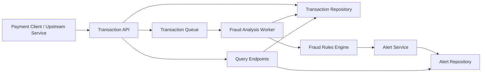
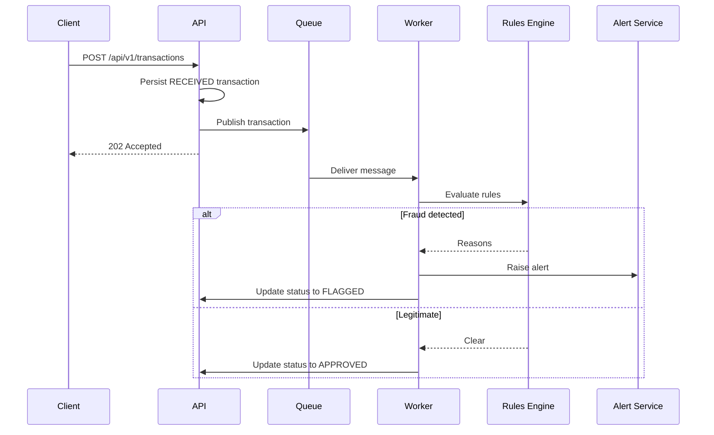

# Real-Time Fraud Detection System

This repository contains a Java Spring Boot implementation of a real-time fraud detection service designed for Kubernetes deployment. It ingests transaction events, evaluates them with rule-based fraud detection, raises alerts for suspicious activity, and exposes health endpoints suitable for cloud-native operations.

## Features

- Real-time transaction ingestion through a REST API.
- Asynchronous queue-backed fraud analysis pipeline.
- Rule-based detection for high amount, suspicious accounts, and velocity bursts.
- Alert generation with severity classification.
- Optional Telegram bot notifications for flagged alerts.
- JSON console logging for Kubernetes and Alibaba Cloud Simple Log Service ingestion.
- Kubernetes deployment manifests with probes and autoscaling.
- Unit and integration tests with JaCoCo coverage report generation.

## Architecture



## Sequence



## Design Choices

- `Spring Boot` keeps the service easy to run locally and easy to extend with production adapters.
- `TransactionQueue` is an interface so the current in-memory queue can be replaced with AWS SQS, Google Pub/Sub, or Alibaba Message Service without changing business logic.
- `FraudRule` isolates each detection rule, making the rules engine easy to test and evolve.
- `Actuator` exposes liveness and readiness probes for Kubernetes.
- `In-memory repositories` keep this sample self-contained. In production, replace them with PostgreSQL, Redis, or a streaming store.
- `AlertNotifier` keeps outbound notifications modular, so Telegram can be swapped or supplemented with other channels later.

## API

### Submit transaction

```bash
curl -X POST http://localhost:8080/api/v1/transactions \
  -H "Content-Type: application/json" \
  -d '{
    "accountId": "acct-blacklist-001",
    "merchantId": "merchant-123",
    "deviceId": "device-007",
    "ipAddress": "192.168.1.25",
    "currency": "USD",
    "amount": 250.00
  }'
```

### Check transaction status

```bash
curl http://localhost:8080/api/v1/transactions/<transaction-id>
```

### List alerts

```bash
curl http://localhost:8080/api/v1/alerts
```

## Local Run

```bash
mvn spring-boot:run
```

## Telegram Notifications

To enable Telegram alert delivery, configure:

```yaml
alert:
  telegram:
    enabled: true
    bot-token: <your-bot-token>
    chat-id: <target-chat-id-or-username>
    base-url: https://api.telegram.org
    disable-notification: false
```

When enabled, each fraud alert is stored and logged as before, then also sent through the Telegram Bot API.

## Alibaba Cloud Log Service

This project is set up to work well with Alibaba Cloud Simple Log Service by writing structured JSON logs to container `stdout`.

### Logging approach

- The application uses [logback-spring.xml](/Users/vincent/git-workspace/test-app/src/main/resources/logback-spring.xml) to emit JSON logs by default.
- Logs go to console instead of local files, which is the recommended pattern for Kubernetes collection.
- You can disable JSON locally by setting `LOGGING_JSON_ENABLED=false`.

Example local run with plain-text logs:

```bash
LOGGING_JSON_ENABLED=false mvn spring-boot:run
```

### ACK integration

For Alibaba Cloud ACK, the common pattern is:

1. Deploy the app to ACK.
2. Enable Simple Log Service collection for pod `stdout` and `stderr`.
3. Send logs into an SLS `Project` and `Logstore`.
4. Query the structured JSON fields in SLS.

The deployment manifest already includes basic SLS-friendly annotations and emits logs to stdout:

- [deployment.yaml](/Users/vincent/git-workspace/test-app/k8s/deployment.yaml)
- [sls-pipeline-config.yaml](/Users/vincent/git-workspace/test-app/k8s/sls-pipeline-config.yaml)

If your ACK cluster uses CRD- or console-based log collection, point collection at this workload’s container stdout. Also enable multiline handling for Java stack traces.

### Example AliyunPipelineConfig

This repo includes a CRD example for SLS collection:

```bash
kubectl apply -f k8s/sls-pipeline-config.yaml
```

Before applying it, update these values in [sls-pipeline-config.yaml](/Users/vincent/git-workspace/test-app/k8s/sls-pipeline-config.yaml):

- `spec.project.name`
- `spec.project.endpoint`
- `spec.logstores[0].name`
- `K8sNamespaceRegex` if your app is not deployed to `default`

This example:

- collects `stdout` and `stderr` with `input_container_stdio`
- filters pods by label `app=fraud-detection`
- parses JSON from the `content` field
- flushes logs into the target SLS Logstore

### Verify the CRD

After applying:

```bash
kubectl get clusteraliyunpipelineconfigs
kubectl get clusteraliyunpipelineconfigs fraud-detection-stdout -o yaml
```

Look for a successful status on the resource before validating logs in SLS.

### Example log fields

Each log line includes fields such as:

- `@timestamp`
- `app`
- `level`
- `logger`
- `thread`
- `message`
- `trace`
- `span`

### Recommended SLS setup

- Create an SLS `Project`
- Create a `Logstore` such as `fraud-detection-prod`
- Configure ACK log collection for this deployment
- Use JSON extraction in SLS so fields are queryable
- Enable multiline merge for stack traces

### Suggested SLS queries

```text
app: fraud-detection
```

```text
app: fraud-detection and level: ERROR
```

```text
app: fraud-detection and message: fraud-alert
```

```text
logger: com.vincent.fraud.service.AlertService
```

### Useful references

- [Alibaba Cloud Simple Log Service: Kubernetes container log collection](https://www.alibabacloud.com/help/doc-detail/2878919.html)
- [Alibaba Cloud ACK: collect application logs with Log Service](https://www.alibabacloud.com/help/en/ack/serverless-kubernetes/user-guide/use-log-service-to-collect-application-logs)

## Test

```bash
mvn test
mvn verify
```

JaCoCo HTML coverage output is generated under `target/site/jacoco/index.html` after `mvn verify`.

## Kubernetes

Manifests are available in `k8s/`:

- `deployment.yaml`
- `service.yaml`
- `hpa.yaml`
- `configmap.yaml`
- `sls-pipeline-config.yaml`

Apply them with:

```bash
kubectl apply -f k8s/
```

For production, build the application image and update `your-registry/fraud-detection:latest` in the deployment manifest.

## Resilience Notes

- Multiple replicas are configured to reduce single-pod failure risk.
- Liveness and readiness probes support pod restart and traffic draining.
- Horizontal Pod Autoscaler handles CPU-based scale-out.
- The queue boundary decouples ingestion from fraud analysis, reducing end-user latency.

## Future Improvements

- Replace the in-memory queue with SQS, Pub/Sub, or Alibaba Message Service.
- Persist transactions and alerts in a durable database.
- Add distributed tracing and externalized audit storage.
- Introduce dead-letter queue handling and retry policies.
