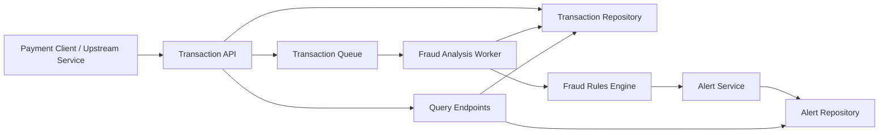
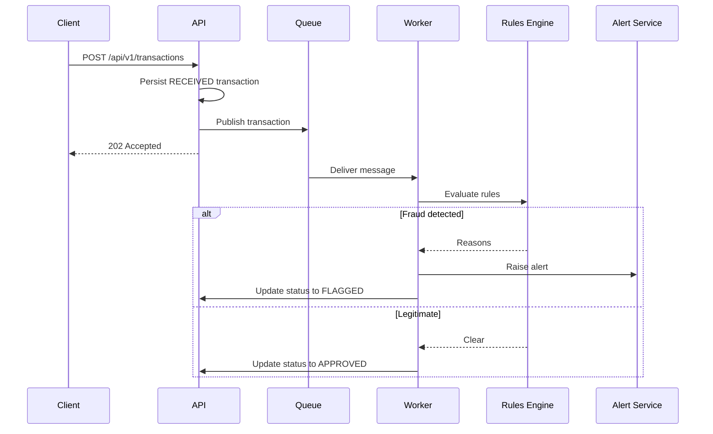

# Real-Time Fraud Detection System

This repository contains a Java Spring Boot implementation of a real-time fraud detection service designed for Kubernetes deployment. It ingests transaction events, evaluates them with rule-based fraud detection, raises alerts for suspicious activity, and exposes health endpoints suitable for cloud-native operations.

## Features

- Real-time transaction ingestion through a REST API.
- Asynchronous queue-backed fraud analysis pipeline.
- Rule-based detection for high amount, suspicious accounts, and velocity bursts.
- Alert generation with severity classification.
- Kubernetes deployment manifests with probes and autoscaling.
- Unit and integration tests with JaCoCo coverage report generation.

## Architecture



## Sequence



## Design Choices

- `Spring Boot` keeps the service easy to run locally and easy to extend with production adapters.
- `TransactionQueue` is an interface so the current in-memory queue can be replaced with AWS SQS, Google Pub/Sub, or Alibaba Message Service without changing business logic.
- `FraudRule` isolates each detection rule, making the rules engine easy to test and evolve.
- `Actuator` exposes liveness and readiness probes for Kubernetes.
- `In-memory repositories` keep this sample self-contained. In production, replace them with PostgreSQL, Redis, or a streaming store.

## API

### Submit transaction

```bash
curl -X POST http://localhost:8080/api/v1/transactions \
  -H "Content-Type: application/json" \
  -d '{
    "accountId": "acct-blacklist-001",
    "merchantId": "merchant-123",
    "deviceId": "device-007",
    "ipAddress": "192.168.1.25",
    "currency": "USD",
    "amount": 250.00
  }'
```

### Check transaction status

```bash
curl http://localhost:8080/api/v1/transactions/<transaction-id>
```

### List alerts

```bash
curl http://localhost:8080/api/v1/alerts
```

## Local Run

```bash
mvn spring-boot:run
```

## Test

```bash
mvn test
mvn verify
```

JaCoCo HTML coverage output is generated under `target/site/jacoco/index.html` after `mvn verify`.

## Kubernetes

Manifests are available in `k8s/`:

- `deployment.yaml`
- `service.yaml`
- `hpa.yaml`
- `configmap.yaml`

Apply them with:

```bash
kubectl apply -f k8s/
```

For production, build the application image and update `your-registry/fraud-detection:latest` in the deployment manifest.

## Resilience Notes

- Multiple replicas are configured to reduce single-pod failure risk.
- Liveness and readiness probes support pod restart and traffic draining.
- Horizontal Pod Autoscaler handles CPU-based scale-out.
- The queue boundary decouples ingestion from fraud analysis, reducing end-user latency.

## Future Improvements

- Replace the in-memory queue with SQS, Pub/Sub, or Alibaba Message Service.
- Persist transactions and alerts in a durable database.
- Add distributed tracing and externalized audit storage.
- Introduce dead-letter queue handling and retry policies.
