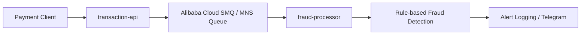

# Fraud Platform on Alibaba Cloud SMQ

This repository is now split into two independently deployable applications plus one shared module:

- `transaction-api`: receives transactions over HTTP and publishes them to Alibaba Cloud Simple Message Queue (MNS/SMQ)
- `fraud-processor`: consumes messages from the queue, evaluates fraud rules, and raises alerts
- `shared`: common DTOs shared by both applications

## Why this split scales

- `transaction-api` is stateless. You can run multiple replicas behind a Kubernetes `Service`.
- `fraud-processor` is also stateless with respect to queue consumption. Multiple replicas act as competing consumers on the same Alibaba Cloud queue.
- Queue-based decoupling absorbs traffic spikes and lets ingestion scale independently from fraud processing.

## Module layout

```text
shared/
transaction-api/
fraud-processor/
k8s/
```

## Architecture



## Build

Build everything:

```bash
mvn -DskipTests package
```

Build one service:

```bash
mvn -pl transaction-api -am -DskipTests package
mvn -pl fraud-processor -am -DskipTests package
```

## Local run

Run the HTTP ingress app:

```bash
mvn -pl transaction-api spring-boot:run
```

Run the fraud processor:

```bash
mvn -pl fraud-processor spring-boot:run
```

## Configuration

Both applications use the same Alibaba Cloud queue configuration:

```bash
export MNS_ENDPOINT=http://<account-id>.mns.<region>.aliyuncs.com/
export MNS_QUEUE_NAME=fraud-transactions
export MNS_ACCESS_KEY_ID=<your-access-key-id>
export MNS_ACCESS_KEY_SECRET=<your-access-key-secret>
```

### transaction-api

The producer service listens on `POST /api/v1/transactions` and publishes a JSON transaction event to SMQ.

Example request:

```bash
curl -X POST http://localhost:8080/api/v1/transactions \
  -H "Content-Type: application/json" \
  -d '{
    "accountId": "acct-blacklist-001",
    "merchantId": "merchant-123",
    "deviceId": "device-007",
    "ipAddress": "192.168.1.25",
    "currency": "USD",
    "amount": 250.00
  }'
```

### fraud-processor

The consumer app polls the queue continuously and processes messages with configurable competing-consumer concurrency:

```bash
export CONSUMER_POLLER_CONCURRENCY=2
export CONSUMER_BATCH_SIZE=8
export CONSUMER_WAIT_SECONDS=15
```

Fraud rules are deliberately stateless so horizontal scaling remains safe without pod-local shared memory.

Configurable rules:

```bash
export FRAUD_AMOUNT_THRESHOLD=10000
```

Watchlists are in:

- [fraud-processor application.yml](/Users/vincent/git-workspace/test-app/fraud-processor/src/main/resources/application.yml)

### Telegram alerts

Telegram notifications are sent only by `fraud-processor`.

```bash
export TELEGRAM_ENABLED=true
export TELEGRAM_BOT_TOKEN=<your-bot-token>
export TELEGRAM_CHAT_ID=<your-chat-id>
```

## Docker images

Build the producer image:

```bash
docker build -f transaction-api/Dockerfile -t fraud/transaction-api:latest .
```

Build the consumer image:

```bash
docker build -f fraud-processor/Dockerfile -t fraud/fraud-processor:latest .
```

## Kubernetes on ACK

The `k8s/` directory contains separate manifests for both services:

- `namespace.yaml`
- `shared-configmap.yaml`
- `transaction-api-configmap.yaml`
- `transaction-api-deployment.yaml`
- `transaction-api-service.yaml`
- `transaction-api-hpa.yaml`
- `fraud-processor-configmap.yaml`
- `fraud-processor-deployment.yaml`
- `fraud-processor-hpa.yaml`

### Deploy

```bash
kubectl apply -f k8s/namespace.yaml
kubectl apply -f k8s/shared-configmap.yaml
kubectl apply -f k8s/transaction-api-configmap.yaml
kubectl apply -f k8s/fraud-processor-configmap.yaml
kubectl apply -f k8s/transaction-api-deployment.yaml
kubectl apply -f k8s/transaction-api-service.yaml
kubectl apply -f k8s/transaction-api-hpa.yaml
kubectl apply -f k8s/fraud-processor-deployment.yaml
kubectl apply -f k8s/fraud-processor-hpa.yaml
```

Before deploying, update the image names in:

- [transaction-api deployment](/Users/vincent/git-workspace/test-app/k8s/transaction-api-deployment.yaml)
- [fraud-processor deployment](/Users/vincent/git-workspace/test-app/k8s/fraud-processor-deployment.yaml)

Create the queue credentials secret:

```bash
kubectl -n fraud-platform create secret generic mns-credentials \
  --from-literal=MNS_ACCESS_KEY_ID=<your-access-key-id> \
  --from-literal=MNS_ACCESS_KEY_SECRET=<your-access-key-secret>
```

Shared values such as `MNS_ENDPOINT`, `MNS_QUEUE_NAME`, and `LOGGING_JSON_ENABLED` now live in:

- [shared-configmap.yaml](/Users/vincent/git-workspace/test-app/k8s/shared-configmap.yaml)

App-specific knobs stay in:

- [transaction-api-configmap.yaml](/Users/vincent/git-workspace/test-app/k8s/transaction-api-configmap.yaml)
- [fraud-processor-configmap.yaml](/Users/vincent/git-workspace/test-app/k8s/fraud-processor-configmap.yaml)

### Verify

```bash
kubectl get pods -n fraud-platform
kubectl get svc -n fraud-platform
kubectl get hpa -n fraud-platform
kubectl logs -n fraud-platform deploy/transaction-api
kubectl logs -n fraud-platform deploy/fraud-processor
```

## Horizontal scaling notes

- `transaction-api` scales behind `transaction-api-service`
- `fraud-processor` scales as multiple queue consumers
- failed messages are not deleted from SMQ, so they can be retried after the queue visibility timeout
- because the rules are stateless, processing stays replica-safe

If you later need stateful rules such as transaction velocity across replicas, introduce a shared external state store such as Redis, Tair, or a database rather than pod-local memory.

## Testing

Run all module tests:

```bash
mvn test
```

Run one module:

```bash
mvn -pl transaction-api test
mvn -pl fraud-processor test
```

## Alibaba Cloud references

- [Java SDK for Alibaba Cloud MNS](https://www.alibabacloud.com/help/en/mns/developer-reference/java-sdk-send-message)
- [Receive messages with the Java SDK](https://www.alibabacloud.com/help/en/mns/developer-reference/java-sdk-receive-message)
- [ACK deployment with kubectl](https://www.alibabacloud.com/help/en/ack/ack-managed-and-ack-dedicated/getting-started/use-the-nginx-image-supported-by-ack-to-deploy-stateless-applications)
