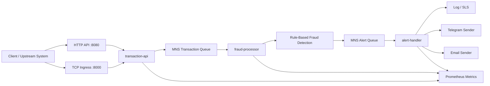
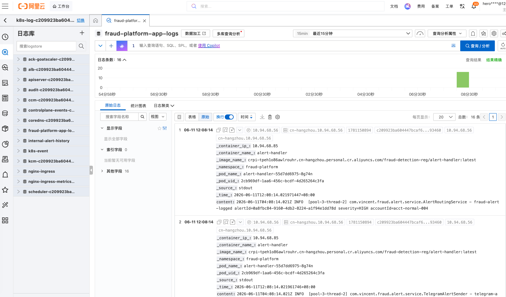
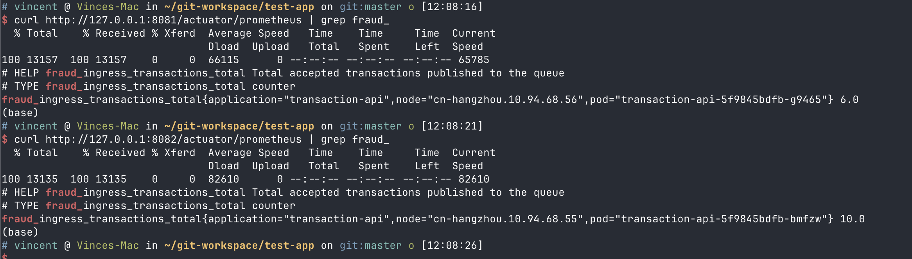

# Fraud Platform on Alibaba Cloud

This repository contains a real-time fraud detection platform built as three independently scalable Spring Boot applications on Alibaba Cloud.

For deployment instructions, see [Installation.md](/Users/vincent/git-workspace/test-app/Installation.md).

## Overall Introduction

The platform separates ingestion, fraud detection, and alert handling into different applications so that each stage can scale horizontally and evolve independently.

Modules:

- `transaction-api`: accepts transaction requests and publishes them to Alibaba Cloud MNS / SMQ
- `fraud-processor`: consumes transaction messages, applies fraud rules, and emits alert events
- `alert-handler`: consumes alert events and routes them to downstream notification actions
- `shared`: common DTOs and shared message contracts

Supported ingress options:

- HTTP: `POST /api/v1/transactions`
- TCP: raw line-based transaction submission on port `8000`

## Architecture Design



### Node Description

- `transaction-api`
  - entry point for external callers
  - validates payloads
  - supports both HTTP and TCP ingress
  - publishes normalized transaction events to the transaction queue
  - remains stateless, so it can scale behind a Kubernetes `Service`

- `fraud-processor`
  - consumes messages from the transaction queue
  - evaluates fraud rules such as amount threshold and suspicious account / merchant lists
  - publishes alert events to a separate alert queue
  - scales through competing queue consumers

- `alert-handler`
  - consumes alert events from the alert queue
  - routes by severity
  - current behavior:
    - `HIGH`: Telegram + log
    - `MEDIUM`: Email + log
    - `LOW`: log only
  - scales independently from ingestion and fraud detection

- `shared`
  - provides shared message models used by all applications
  - keeps event contracts consistent across the services

### Why the Design Scales

- queue decoupling absorbs bursts between stages
- each application can be scaled horizontally without changing the others
- ACK HPA can scale each deployment independently
- alert processing does not block transaction ingestion

## Interfaces

### HTTP Interface

`transaction-api` exposes:

```text
POST /api/v1/transactions
```

Example:

```bash
curl -X POST http://localhost:8080/api/v1/transactions \
  -H "Content-Type: application/json" \
  -d '{
    "accountId": "acct-blacklist-001",
    "merchantId": "merchant-123",
    "deviceId": "device-007",
    "ipAddress": "192.168.1.25",
    "currency": "USD",
    "amount": 250.00
  }'
```

### TCP Interface

`transaction-api` also exposes TCP ingress on port `8000`.

The payload is a single JSON object per line. This is useful when an upstream system prefers socket-based delivery over HTTP.

Example using the included script:

```bash
./scripts/send-transactions-tcp.sh testtransactions.csv
```

## Logging and Observability

Application logs can be centralized into Alibaba Cloud SLS / Log Service.



All three applications also expose Prometheus metrics through:

```text
/actuator/prometheus
```

Examples:

```bash
kubectl -n fraud-platform port-forward deploy/transaction-api 8081:8080
curl http://127.0.0.1:8081/actuator/prometheus | grep fraud_

kubectl -n fraud-platform port-forward deploy/fraud-processor 8082:8080
curl http://127.0.0.1:8082/actuator/prometheus | grep fraud_

kubectl -n fraud-platform port-forward deploy/alert-handler 8083:8080
curl http://127.0.0.1:8083/actuator/prometheus | grep fraud_
```

Current custom metrics:

- `fraud_ingress_transactions_total`
- `fraud_data_points_processed_total`
- `fraud_alerts_handled_total`

ACK Prometheus metric view example:



Recommended PromQL queries:

Per pod:

```promql
sum by (pod) (fraud_ingress_transactions_total)
sum by (pod) (fraud_data_points_processed_total)
sum by (pod) (fraud_alerts_handled_total)
```

Per node:

```promql
sum by (node) (fraud_ingress_transactions_total)
sum by (node) (fraud_data_points_processed_total)
sum by (node) (fraud_alerts_handled_total)
```

Rate by node:

```promql
sum by (node) (rate(fraud_ingress_transactions_total[5m]))
sum by (node) (rate(fraud_data_points_processed_total[5m]))
sum by (node) (rate(fraud_alerts_handled_total[5m]))
```

## Testing the Public Endpoint

If `transaction-api` is exposed by a `LoadBalancer`, get the public IP:

```bash
kubectl -n fraud-platform get svc transaction-api
```

Then send sample traffic:

```bash
BASE_URL=http://<external-ip>/ ./scripts/send-transactions.sh testtransactions.csv
```

This is the quickest end-to-end validation that:

- the API is reachable
- the queue publish path works
- `fraud-processor` is consuming
- alerts are generated when suspicious transactions are submitted

## Future Extensions

The current design is intentionally simple, but it leaves room for several useful extensions.

### Replace the Alert Queue with Topic-Based Fan-Out

Today, alerts are pushed to one alert queue and consumed by `alert-handler`. A future improvement is to publish alerts to an Alibaba Cloud MNS / SMQ topic instead of a single queue.

Benefits:

- different consumers can subscribe independently
- one consumer can handle Telegram
- another can handle email
- another can write to audit storage or incident systems
- notification logic can evolve without coupling all alert actions into one service

This is a better fit when you want parallel processing by alert type or by downstream integration.

### Introduce a Central Cache for Aggregated Rules

The current fraud rules are simple stateless checks. If you later need aggregated rules such as:

- transaction count per account in the last 5 minutes
- velocity checks per device or IP
- cumulative amount thresholds across a time window

then introduce a central caching layer such as Redis.

Benefits:

- supports rolling-window and aggregation-based fraud rules
- shared state across multiple `fraud-processor` replicas
- low-latency lookups for account, device, and IP activity

### Additional Evolution Options

- add dead-letter queues for poison messages
- add real Telegram and email integrations
- add dynamic rule management from database or config service
- split high-priority and low-priority alerts into different streams
- add model-based scoring alongside rule-based detection

## Repository Layout

```text
shared/
transaction-api/
fraud-processor/
alert-handler/
k8s/
.github/workflows/
images/
```
